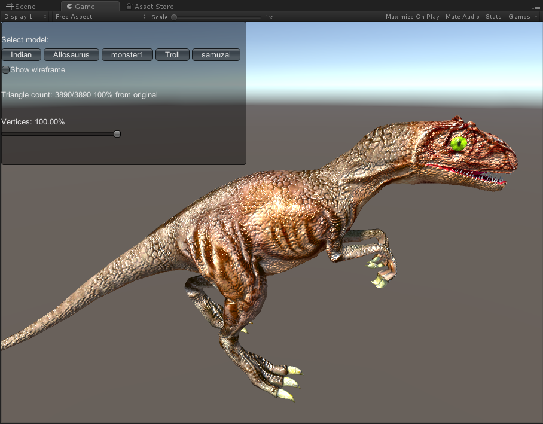
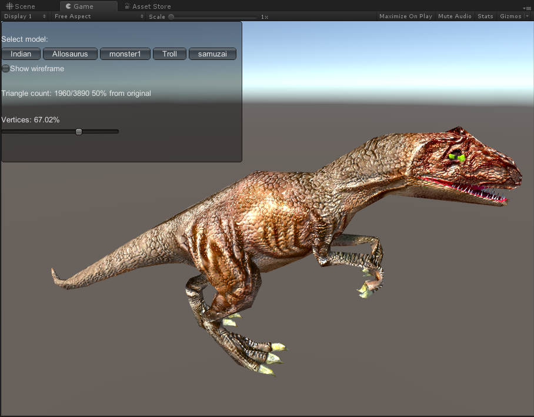
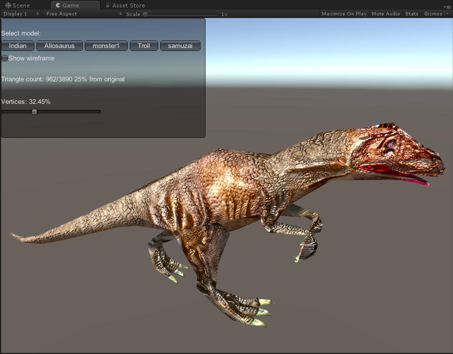
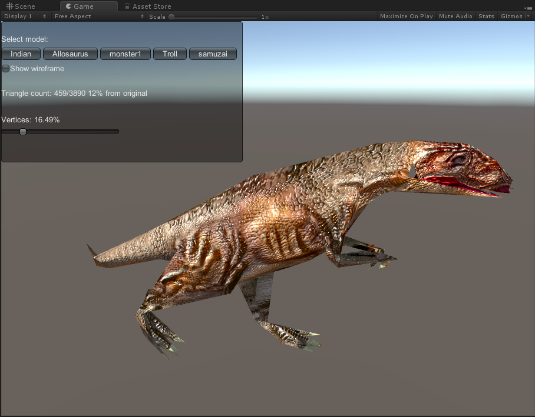
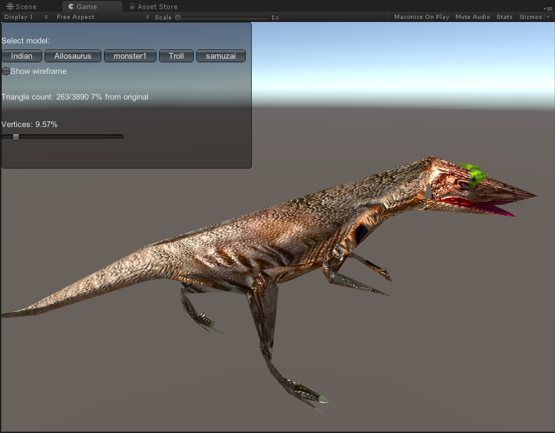
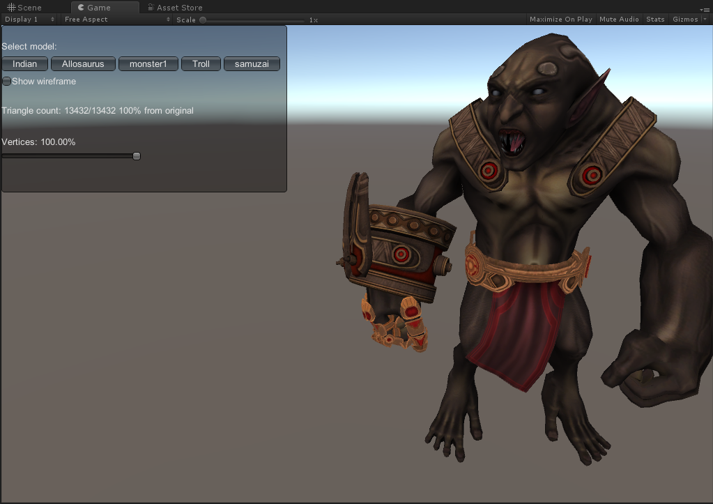
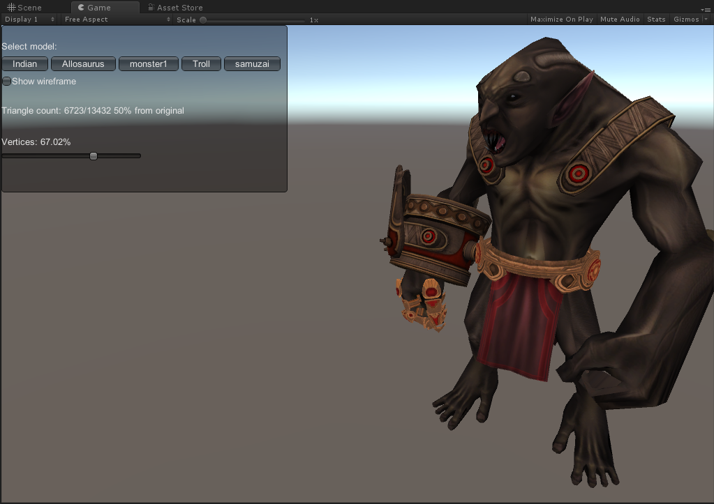
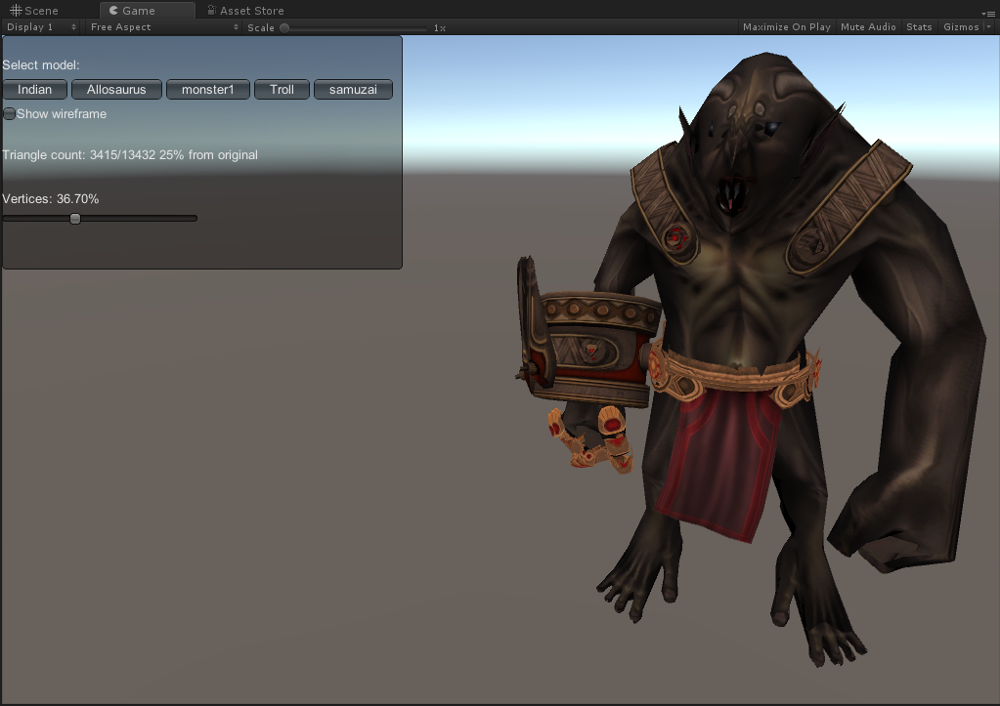
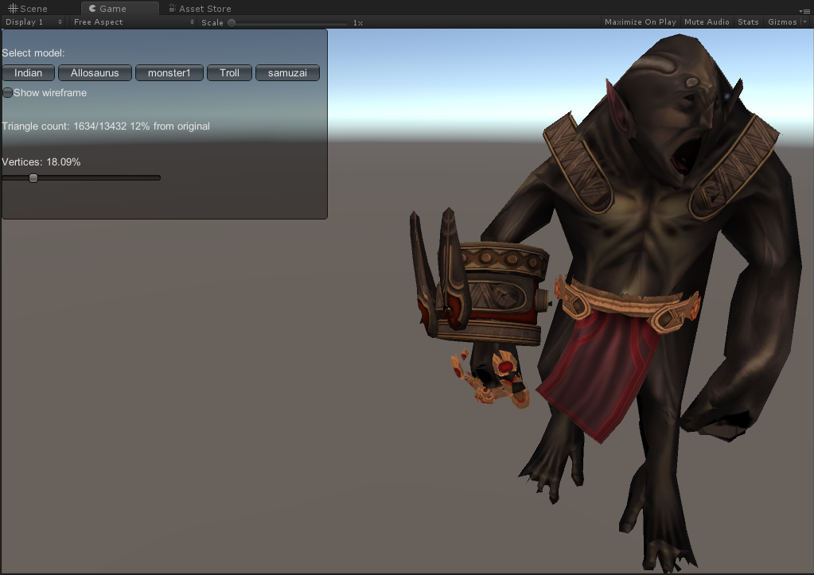
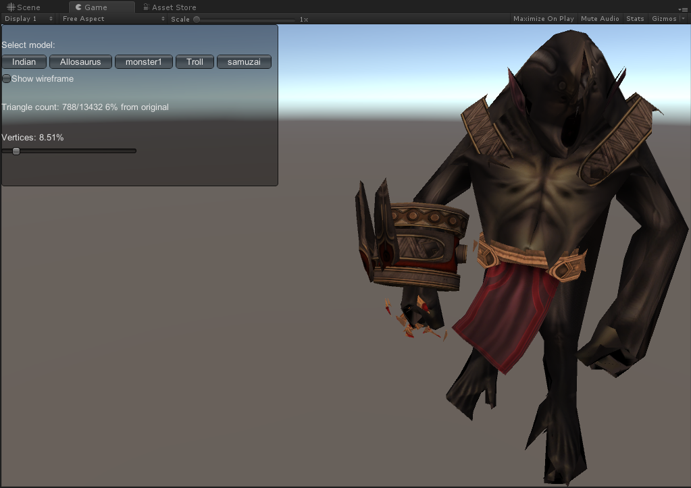

# UnityMeshSimplify

# Demo

01 - Simplify Mesh Preview

# Results

## Allosaurus

### 3890 triangles（original）
 

### 1960 triangles
 

### 962 triangles
 

### 459 triangles
 

### 263 triangles
 

## Troll

### 13432 triangles（original）
 

### 6723 triangles
 

### 3415 triangles
 

### 1634 triangles
 

### 788 triangles
 
